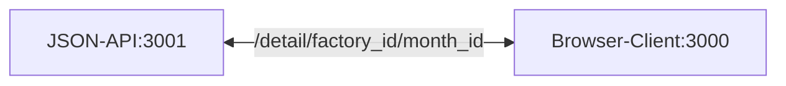

# Test Recharts Lib

## To consist of

* Vite 4
* React 18
* Router 6
* Ant Design 5
* Json-server 0
* Concurrently 8
* Rollup plugin Visualizer 5

## Uses

* Docker
* Dispatch without Redux
* Thinkfull and fast Reducer
* Responsive design
* Light functional components on Hooks

## How it works


* Start JSON-API 

```sh
npm run json-db
```

* Start Client

```sh
npm start
```

#### Or All together in different combinations, see package.json file.
